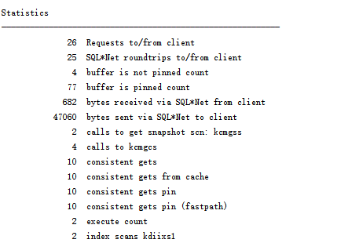

# 实验一
## 实验分析
- 查询1
```sql
SELECT d.department_name，count(e.job_id)as "部门总人数"，
avg(e.salary)as "平均工资"
from hr.departments d，hr.employees e
where d.department_id = e.department_id
and d.department_name in ('IT'，'Sales')
GROUP BY department_name;
```
实验结果截图：<br><br>
<br>
执行计划：<br><br>



分析执行计划：<br>
  计划有EXPLAIN PLAN，Predicate Information等。其中EXPLAIN PLAN（执行计划）的输出是一个表，属性有ID、Operation、Name、Rows、Bytes、Cost(%CPU)和Time。当前的Cost值为5。<br>

得到的优化指导结果：<br><br>

<br>
系统所给建议：<br>


----------
- 查询2
```sql
SELECT d.department_name，count(e.job_id)as "部门总人数"，
avg(e.salary)as "平均工资"
FROM hr.departments d，hr.employees e
WHERE d.department_id = e.department_id
GROUP BY department_name
HAVING d.department_name in ('IT'，'Sales');
```
实验结果截图：<br><br>

<br>
执行计划：<br><br>


分析执行计划：<br>
  计划同查询1一样。当前的Cost值为7。<br>
  
得到的优化指导结果：<br><br>
<br>
第二个查询系统没有给出建议。

结论：<br>
  对于查询语句本身来说。主要是WHERE和HAVING的区别，group by的先后顺序。WHERE从所有数据中筛选出需要的数据，之后才进行分组。第二个查询语句中HAVING 是在GROUP BY分组之后，可以在HAVING子句中使用统计函数。<br>
  就目前而言，第一个查询consistent gets值为10，第二个为9，第二个优于第一个；第一个cost值为5，第二个为7，第一个优于第二个。不知道physical reads。<br>
  无法用公式确切判断哪个更优化。但是第一个系统给出了优化建议，所以综合判断查询2更优化。<br>
 （尽量避免语句做全盘扫描。对于全盘扫描的语句，应增加相关的索引，优化SQL语句来解决。）<br>
 ## 教材中的文档
 - 原查询语句
 ```sql
SELECT e.employee_id, e.first_name, e.manager_id,
(SELECT  m.first_name  from  employee m  WHERE  m.employee_id=e.manager_id)
AS manager name FROM hr.employee e ORDER BY e.employee_id;
 ```
分析：<br>
  physical reads和consistent gets是判断数据库性能的重要指标。有一个公式：1-(physical reads/(db block gets+consistent gets))。而上面语句所得到的结果是cost=21，consistent gets=45，physical reads=0。则表明它不是最有效的语句，因为用了子查询语句作为一个字段属性，有嵌套语句，使每输出employee的一行都要再次查询该表，所以时间花的多。<br>
  优化方法是用多表外连接方式查询。<br>
- 优化后的查询语句
```sql
SELECT e.employee_id, e.first_name, e.manager_id, m.first_name
AS manager_name FROM employee e, employee m WHERE
e.manager_id=m.employee_id(+)ORDER BY e.employee_id;
```
分析：<br>
  上面语句得到的结果为cost=6,consistent gets=15，physical reads=0。可见比原查询语句效率高。<br>
  因此，cost会影响执行时间，但cost不是唯一影响执行时间的因素，不能单方面仅由它得出判断，要综合判断执行计划中的所有输出值才能判断一个执行计划的好坏。
## 自定义查询
显示工资在8000到9000之间的员工信息：名字、工资，按工资从大到小排序
```sql
SET AUTOTRACE ON
SELECT concat(first_name,last_name) "员工姓名",salary + salary*commission_pct AS Wage 
FROM employees WHERE salary + salary*commission_pct 
BETWEEN 8000 AND 9000 ORDER BY Wage desc;
```
实验结果截图：<br><br>
<br>
执行计划：<br><br>

<br>
该查询语句会占用CPU资源，说明不够优。
