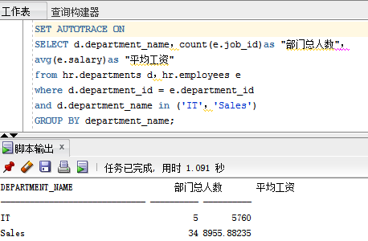
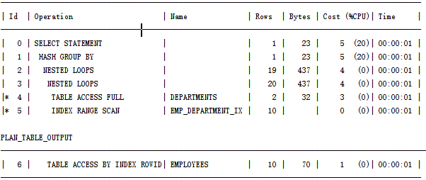

# 实验一
>查询1
```sql
SELECT d.department_name，count(e.job_id)as "部门总人数"，
avg(e.salary)as "平均工资"
from hr.departments d，hr.employees e
where d.department_id = e.department_id
and d.department_name in ('IT'，'Sales')
GROUP BY department_name;
```


----------
>查询2
```sql
SELECT d.department_name，count(e.job_id)as "部门总人数"，
avg(e.salary)as "平均工资"
FROM hr.departments d，hr.employees e
WHERE d.department_id = e.department_id
GROUP BY department_name
HAVING d.department_name in ('IT'，'Sales');
```

