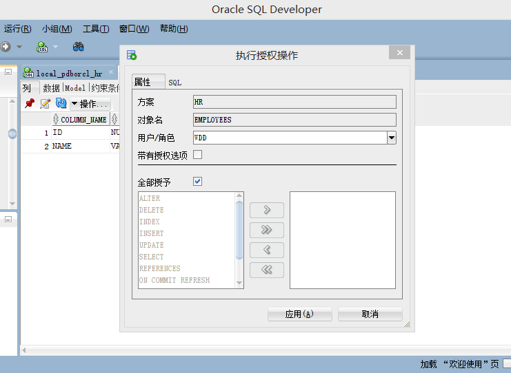

# 实验一
## 实验内容：
   Oracle有一个开发者角色resource，可以创建表、过程、触发器等对象，但是不能创建视图。本训练要求： 
   在pdborcl插接式数据中创建一个新的本地角色con_res_view，该角色包含connect和resource角色，同时也包含CREATE VIEW权限，这样任何拥有con_res_view的用户就同时拥有这三种权限。 
创建角色之后，再创建用户new_user，给用户分配表空间，设置限额为50M，授予con_res_view角色。  
   最后测试：用新用户new_user连接数据库、创建表，插入数据，创建视图，查询表和视图的数据。
## 实验步骤
- 第1步：以system登录到pdborcl，创建角色student_wdd和用户wdd，并授权和分配空间： 
 
 
 
- 第2步：新用户wdd连接到pdborcl，创建表mytable和视图myview，插入数据，最后将myview的SELECT对象权限授予hr用户： 
 
 
 
- 第3步：用户hr连接到pdborcl，查询wdd授予它的视图myview： 
解锁用户wdd： 
 
登陆后： 
 
- 第4步：测试只读共享和读写共享： 
授权只读共享： 
(没有可编辑的笔符号) 
 
授权读写共享： 
(可编辑) 
 
 
 
- 第5步：查看数据库的使用情况： 
 
 
(autoextensible是显示表空间中的数据文件是否自动增加。MAX_MB是指数据文件的最大容量。)
