# 实验三
## 实验目的：

掌握分区表的创建方法，掌握各种分区方式的使用场景。

## 实验内容：
- 本实验使用3个表空间：USERS,USERS02,USERS03。在表空间中创建两张表：订单表(orders)与订单详表(order_details)。
- 使用**自己的账号创建本实验的表**，表创建在上述3个分区，自定义分区策略。
- 你需要使用system用户给你自己的账号分配上述分区的使用权限。你需要使用system用户给你的用户分配可以查询执行计划的权限。
- 表创建成功后，插入数据，数据能并平均分布到各个分区。每个表的数据都应该大于1万行，对表进行联合查询。
- 写出插入数据的语句和查询数据的语句，并分析语句的执行计划。
- 进行分区与不分区的对比实验。

## 实验步骤
### 用户名为：wdd,角色为student_wdd
- 创建orders表及分区<br>
```sql
CREATE TABLE orders 
(
 order_id NUMBER(10, 0) NOT NULL 
 , customer_name VARCHAR2(40 BYTE) NOT NULL 
 , customer_tel VARCHAR2(40 BYTE) NOT NULL 
 , order_date DATE NOT NULL 
 , employee_id NUMBER(6, 0) NOT NULL 
 , discount NUMBER(8, 2) DEFAULT 0 
 , trade_receivable NUMBER(8, 2) DEFAULT 0 
) 
TABLESPACE USERS 
PCTFREE 10 INITRANS 1 
STORAGE (   BUFFER_POOL DEFAULT ) 
NOCOMPRESS NOPARALLEL 
PARTITION BY RANGE (order_date) 
(
 PARTITION PARTITION_BEFORE_2017 VALUES LESS THAN (
 TO_DATE(' 2017-01-01 00:00:00', 'SYYYY-MM-DD HH24:MI:SS', 
 'NLS_CALENDAR=GREGORIAN')) 
 NOLOGGING 
 TABLESPACE USERS 
 PCTFREE 10 
 INITRANS 1 
 STORAGE 
( 
 INITIAL 8388608 
 NEXT 1048576 
 MINEXTENTS 1 
 MAXEXTENTS UNLIMITED 
 BUFFER_POOL DEFAULT 
) 
NOCOMPRESS NO INMEMORY  
, PARTITION PARTITION_BEFORE_2018 VALUES LESS THAN (
TO_DATE(' 2018-01-01 00:00:00', 'SYYYY-MM-DD HH24:MI:SS', 
'NLS_CALENDAR=GREGORIAN')) 
NOLOGGING 
TABLESPACE USERS02 
PCTFREE 10 
 INITRANS 1 
 STORAGE 
( 
 INITIAL 8388608 
 NEXT 1048576 
 MINEXTENTS 1 
 MAXEXTENTS UNLIMITED 
 BUFFER_POOL DEFAULT 
) 
NOCOMPRESS NO INMEMORY 
, PARTITION PARTITION_BEFORE_2019 VALUES LESS THAN (
TO_DATE(' 2019-01-01 00:00:00', 'SYYYY-MM-DD HH24:MI:SS', 
'NLS_CALENDAR=GREGORIAN')) 
NOLOGGING 
TABLESPACE USERS03 
PCTFREE 10 
 INITRANS 1 
 STORAGE 
( 
 INITIAL 8388608 
 NEXT 1048576 
 MINEXTENTS 1 
 MAXEXTENTS UNLIMITED 
 BUFFER_POOL DEFAULT 
) 
NOCOMPRESS NO INMEMORY 
);
```
操作结果：<br>
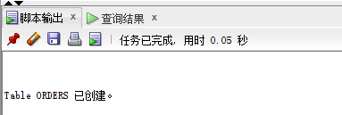<br>
将orders表中的order_id设为主键。
- 创建order_details表及分区
```sql
CREATE TABLE order_details 
(
id NUMBER(10, 0) NOT NULL 
, order_id NUMBER(10, 0) NOT NULL
, product_id VARCHAR2(40 BYTE) NOT NULL 
, product_num NUMBER(8, 2) NOT NULL 
, product_price NUMBER(8, 2) NOT NULL 
, CONSTRAINT order_details_fk1 FOREIGN KEY  (order_id)
REFERENCES orders  (  order_id   )
ENABLE 
) 
TABLESPACE USERS 
PCTFREE 10 INITRANS 1 
STORAGE (   BUFFER_POOL DEFAULT ) 
NOCOMPRESS NOPARALLEL
PARTITION BY REFERENCE (order_details_fk1)
(
PARTITION PARTITION_BEFORE_2017 
NOLOGGING 
TABLESPACE USERS
PCTFREE 10 
 INITRANS 1 
 STORAGE 
( 
 INITIAL 8388608 
 NEXT 1048576 
 MINEXTENTS 1 
 MAXEXTENTS UNLIMITED 
 BUFFER_POOL DEFAULT 
) 
NOCOMPRESS NO INMEMORY
,PARTITION PARTITION_BEFORE_2018
NOLOGGING 
TABLESPACE USERS02
PCTFREE 10 
 INITRANS 1 
 STORAGE 
( 
 INITIAL 8388608 
 NEXT 1048576 
 MINEXTENTS 1 
 MAXEXTENTS UNLIMITED 
 BUFFER_POOL DEFAULT 
) 
NOCOMPRESS NO INMEMORY  
,PARTITION PARTITION_BEFORE_2019
NOLOGGING 
TABLESPACE USERS03
PCTFREE 10 
 INITRANS 1 
 STORAGE 
( 
 INITIAL 8388608 
 NEXT 1048576 
 MINEXTENTS 1 
 MAXEXTENTS UNLIMITED 
 BUFFER_POOL DEFAULT 
) 
NOCOMPRESS NO INMEMORY  
);
```
操作结果：<br>
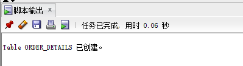<br>
- 使用system账号分配查询权限<br>
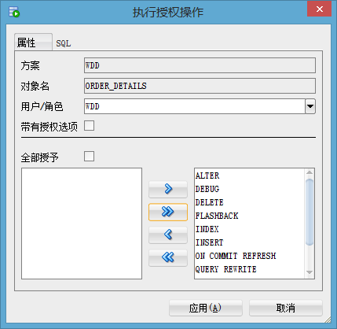<br>
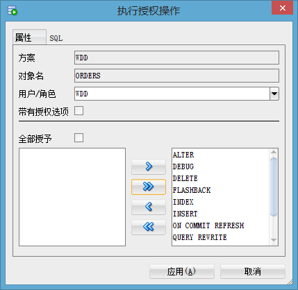<br>
- 使用个人账号分配查询权限<br>
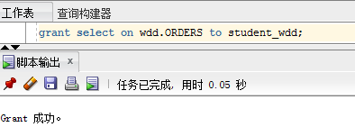<br>
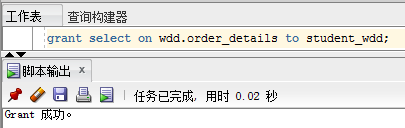<br>
- 分配表空间权限<br>
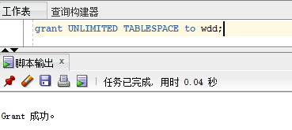<br>

- 插入数据，数据能并平均分布到各个分区<br>
插入orders表数据：
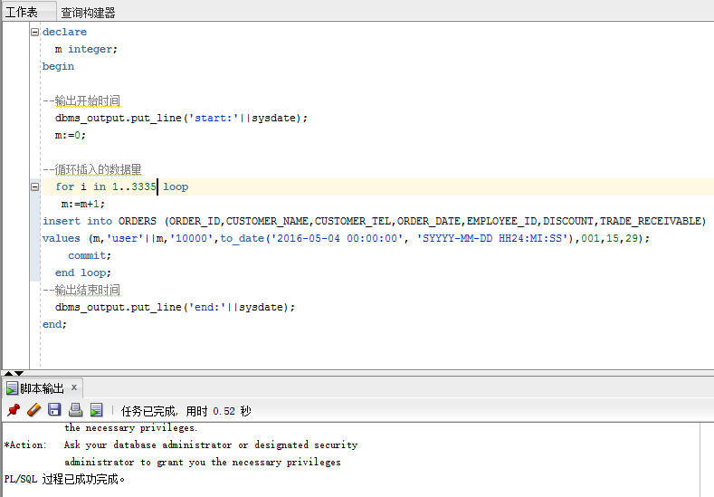<br>
每执行一次将结果代入m值进行修改使得数据平均插入到不同的分区里面。<br>
查询成功结果截图：<br>
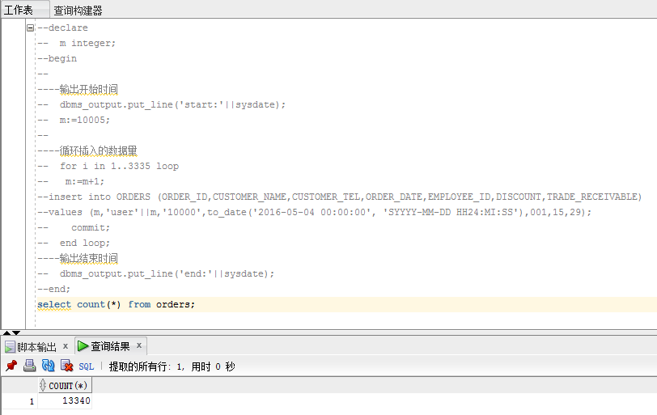<br>
插入order_details表数据及最终结果截图：<br>
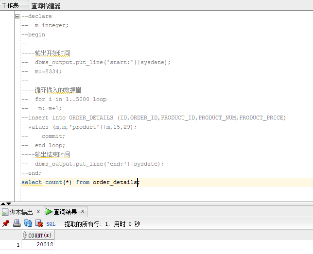<br>
两个表中插入的数据都超过了一万行。<br>
- 联合查询<br>
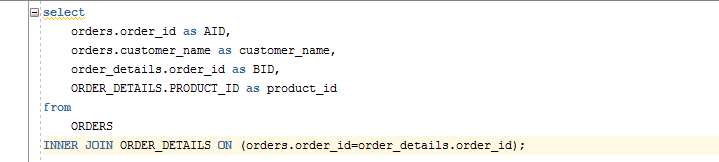<br>
查询结果：<br>
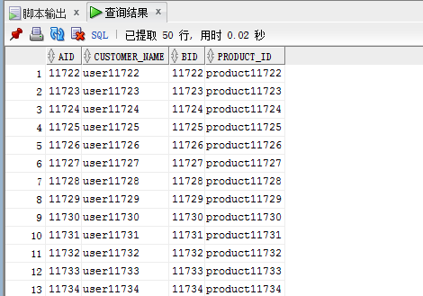<br>

- 分析语句的执行计划<br>
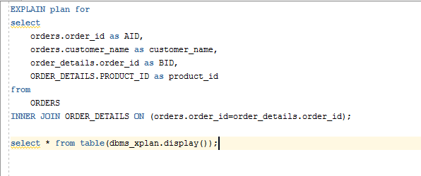<br>
操作结果：<br>
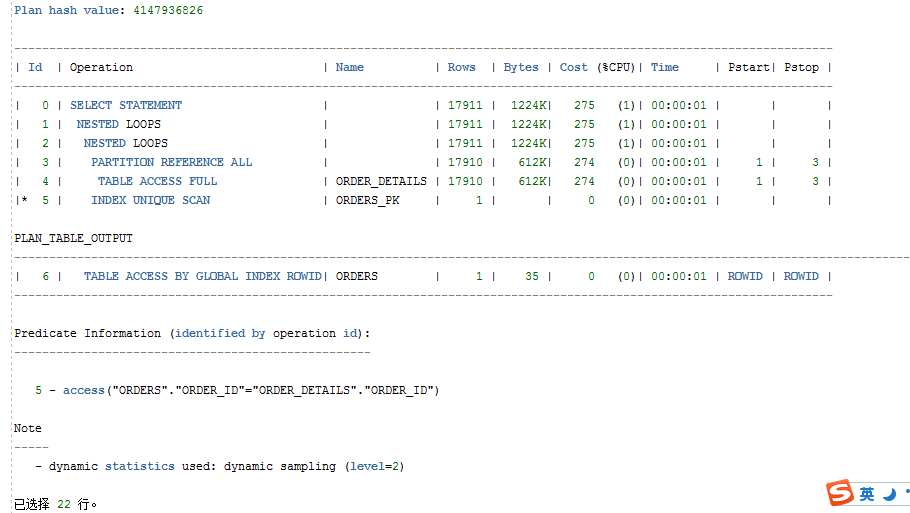<br>
由执行结果可知：最先执行的是TABLE ACCESS FULL，意思为对order_details表进行全表扫描。
然后其次执行的是PARTITION REFERENCE ALL，对分区进行引用。
然后对order_id进行索引唯一扫描，因为为order_details的外键。
又因为使用了join，所以又进行了NESTED LOOPS连接查询。
再对orders表进行TABLE ACCESS BY GLOBAL INDEX ROWID，即rowid与索引的扫描，找出符合条件的元素。
最后将数据查出。
- 分区与不分区<br>
表进行分区后，逻辑上表仍然是一张完整的表，只是将表中的数据在物理上存放到多个表空间，这样查询数据时，不至于每次都扫描整张表。提高了查询的速度。<br>
对于需要存储大量数据的表来说，分区是很有必要的。
