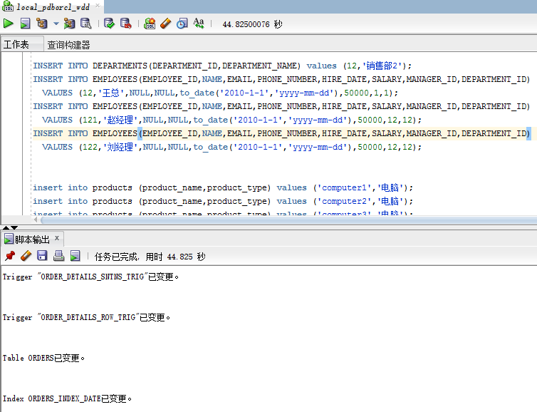

# 实验四
## 实验目的：
了解Oracle表和视图的概念，学习使用SQL语句Create Table创建表，学习Select语句插入，修改，删除以及查询数据，学习使用SQL语句创建视图，学习部分存储过程和触发器的使用。
## 实验场景
假设有一个生产某个产品的单位，单位接受网上订单进行产品的销售。通过实验模拟这个单位的部分信息：员工表，部门表，订单表，订单详单表。
## 实验内容
### 录入数据：
要求至少有1万个订单，每个订单至少有4个详单。至少有两个部门，每个部门至少有1个员工，其中只有一个人没有领导，一个领导至少有一个下属，并且它的下属是另一个人的领导（比如A领导B，B领导C）。
### 序列的应用
插入ORDERS和ORDER_DETAILS 两个表的数据时，主键ORDERS.ORDER_ID, ORDER_DETAILS.ID的值必须通过序列SEQ_ORDER_ID和SEQ_ORDER_ID取得，不能手工输入一个数字。
### 触发器的应用：
维护ORDER_DETAILS的数据时（insert,delete,update）要同步更新ORDERS表订单应收货款ORDERS.Trade_Receivable的值。
### 查询数据：
    1.查询某个员工的信息
    2.递归查询某个员工及其所有下属，子下属员工。
    3.查询订单表，并且包括订单的订单应收货款: Trade_Receivable= sum(订单详单表.ProductNum*订单详单表.ProductPrice)- Discount。
    4.查询订单详表，要求显示订单的客户名称和客户电话，产品类型用汉字描述。
    5.查询出所有空订单，即没有订单详单的订单。
    6.查询部门表，同时显示部门的负责人姓名。
    7.查询部门表，统计每个部门的销售总金额。
## 实验步骤
### 用户为：wdd
- 建表<br>
登录自己的账号wdd,建表：<br>
<br>
- 查询<br>
查询在order表中order_id号为5652的信息：<br>
<br>
查询在order_details表中id号为5652的信息：<br>
<br>
查询在order_details表中order_id号为5652的信息：<br>
<br>
在Excel表中对该第三个查表信息进行验证：<br>
<br>
结果：信息一致，验证成功。
- 更新<br>
更新在order_details表中id为16955的product_name：<br>
<br>
(运行后点击提交按钮才会真正的更新)<br>
再次查询，发现更新成功：<br>
<br>
<br>
再次进行Excel表验证：<br>
<br>
结果：信息一致，验证成功。<br>
最后重新执行SQL脚本，得到更新后的表。<br>
- sql语句的使用<br>
1.删除数据<br>
```sql
delete from order_details where order_id=2972;
```
<br>
2.插入数据
```sql
insert into order_details VALUES (300001,8011,'paper1',1,3278.23);
```
<br>
3.查询某个员工的信息
```sql
select * from EMPLOYEES where  EMPLOYEE_ID=12;
```
<br>
4.递归查询某个员工及其所有下属，子下属员工
```sql
with cte_child(order_id,customer_tel,order_date)
as(
select order_id,customer_tel,order_date from orders where employee_id=122
union all
select a.order_id,a.customer_tel,a.order_date from orders a
inner join cte_child b on (a.employee_id=b.order_id)
)
select * from cte_child;
```
<br>
5.查询订单表，并且包括订单的订单应收货款: Trade_Receivable= sum(订单详单表.ProductNum*订单详单表.ProductPrice)- Discount
```sql
SELECT
order_id,
pay-discount as Trade_Receivable
from
    (select
        orders.order_id as order_id,
        ORDERS.DISCOUNT as discount,
        sum(PRODUCT_NUM*PRODUCT_PRICE) as pay
        from ORDER_DETAILS 
        inner join ORDERS on(orders.order_id=order_details.order_id) 
        group by orders.order_id, ORDERS.DISCOUNT
);
```
<br>
6.查询订单详表，要求显示订单的客户名称和客户电话，产品类型用汉字描述
```sql
select CUSTOMER_NAME as "客户名称",CUSTOMER_TEL as "客户电话",PRODUCT_TYPE as "产品类型"
from ORDERS o,PRODUCTS p,ORDER_DETAILS d
where o.ORDER_ID=d.ORDER_ID 
and d.PRODUCT_NAME=p.PRODUCT_NAME;
```
<br>
7.查询出所有空订单，即没有订单详单的订单。
```sql
select distinct         
ORDERS.ORDER_ID,ORDERS.CUSTOMER_NAME,
ORDERS.CUSTOMER_TEL,ORDERS.ORDER_DATE,
ORDERS.EMPLOYEE_ID,ORDERS.DISCOUNT,ORDERS.TRADE_RECEIVABLE 
from ORDERS where ORDERS.ORDER_ID not in (select ORDER_ID from ORDER_DETAILS);
```
<br>
8.查询部门表，同时显示部门的负责人姓名。
```sql
select DEPARTMENT_NAME as "部门",MANAGER_ID as "部门负责人" 
from DEPARTMENTS d,EMPLOYEES e
where d.DEPARTMENT_ID=e.DEPARTMENT_ID;
```
<br>
9.查询部门表，统计每个部门的销售总金额
```sql
select DEPARTMENT_NAME,SUM(o.Trade_Receivable)AS "销售总金额"
from DEPARTMENTS d,EMPLOYEES e,ORDERS o
where d.DEPARTMENT_ID=e.DEPARTMENT_ID and e.EMPLOYEE_ID=o.EMPLOYEE_ID group by DEPARTMENT_NAME;
```
<br>
